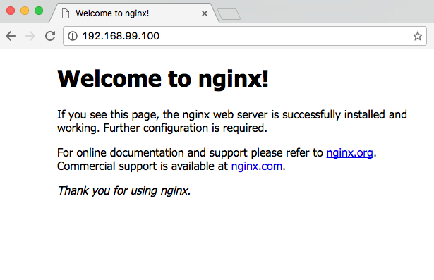

# Docker-Swarm
How to Use a Docker Swarm

1. install virtual box untuk mendapatkan driver untuk machine yang akan dibuat.
2. membuat 3 machine sebagai manager dan 3 machine untuk worker dengan script berikut:
```
#!/bin/bash

# Swarm mode using Docker Machine

#This configures the number of workers and managers in the swarm
managers=3
workers=3

# This creates the manager machines
echo "======> Creating $managers manager machines ...";
for node in $(seq 1 $managers);
do
	echo "======> Creating manager$node machine ...";
	docker-machine create -d virtualbox manager$node;
done

# This create worker machines
echo "======> Creating $workers worker machines ...";
for node in $(seq 1 $workers);
do
	echo "======> Creating worker$node machine ...";
	docker-machine create -d virtualbox worker$node;
done
```
  -simpan dengan nama createmachine.sh, dan jalankan. akan membuat 6 machine dengan 3 manager dan 3 worker.
3. machines yang jalan
```
$ docker-machine ls
NAME       ACTIVE   DRIVER       STATE     URL                         SWARM   DOCKER      ERRORS
manager1   -        virtualbox   Running   tcp://192.168.99.100:2376           v17.03.0-ce   
manager2   -        virtualbox   Running   tcp://192.168.99.101:2376           v17.03.0-ce 
manager3   -        virtualbox   Running   tcp://192.168.99.102:2376           v17.03.0-ce
worker1    -        virtualbox   Running   tcp://192.168.99.103:2376           v17.03.0-ce
worker2    -        virtualbox   Running   tcp://192.168.99.104:2376           v17.03.0-ce
worker3    -        virtualbox   Running   tcp://192.168.99.105:2376           v17.03.0-ce
```
4. menggabungkan antara manager dengan worker dengan script berikut:
```
#!/bin/bash
# masters join swarm
for node in $(seq 3 $managers);
do
	echo "======> manager$node joining swarm as manager ..."
	docker-machine ssh manager$node \
		"docker swarm join \
		--token $manager_token \
		--listen-addr $(docker-machine ip manager$node) \
		--advertise-addr $(docker-machine ip manager$node) \
		$(docker-machine ip manager1)"
done
for node in $(seq 1 $workers);
do
	echo "======> worker$node joining swarm as worker ..."
	docker-machine ssh worker$node \
	"docker swarm join \
	--token $worker_token \
	--listen-addr $(docker-machine ip worker$node) \
	--advertise-addr $(docker-machine ip worker$node) \
	$(docker-machine ip manager1)"
done
```
  - kita dapat mengecek nya dengan: docker-machine ssh manager1 "docker node ls"
  ```
  docker-machine ssh manager1 "docker node ls"
ID                           HOSTNAME  STATUS  AVAILABILITY  MANAGER STATUS
0fk5sbtey3e31qnvftl9lydnj    manager3  Ready   Active        Reachable
afzlek0uq6ky1wl1ksxq7h8ty    manager2  Ready   Active        Reachable
stp8z259uguwlpgehc5oq6po6    worker3   Ready   Active        
ucq8v1sep66ggf3pdw9ohaxik    worker1   Ready   Active        
wwgtx784umfbg6huiyhigx3k5    worker2   Ready   Active        
xsx3hb0n3mx3zqb6yahyt5rha *  manager1  Ready   Active        Leader

  ```
5. mengecek machine yang jalan dengan perintah: docker-machine ls
```
docker-machine ls
NAME       ACTIVE   DRIVER       STATE     URL                         SWARM   DOCKER        ERRORS
manager1   -        virtualbox   Running   tcp://192.168.99.100:2376           v17.04.0-ce   
manager2   -        virtualbox   Running   tcp://192.168.99.101:2376           v17.04.0-ce   
manager3   -        virtualbox   Running   tcp://192.168.99.102:2376           v17.04.0-ce   
worker1    -        virtualbox   Running   tcp://192.168.99.103:2376           v17.04.0-ce   
worker2    -        virtualbox   Running   tcp://192.168.99.104:2376           v17.04.0-ce   
worker3    -        virtualbox   Running   tcp://192.168.99.105:2376           v17.04.0-ce   
```
6. tahap terakhir membuat service. berikut ini langkah untuk membuat sebuah service bernama `web` dengan menjalankan nginx yang terbaru.
```
docker-machine ssh manager1 "docker service create -p 80:80 --name web nginx:latest"
tbmd5tm27sludydahy850d3dx
root@Awan-PC:/home/awan/docker-swarm# docker-machine ssh manager1 "docker service ls"
ID                  NAME                MODE                REPLICAS            IMAGE
tbmd5tm27slu        web                 replicated          0/1                 nginx:latest

```
7. setelah ini kita mengetest halaman nginx yang telah dibuat pada IP: 192.168.99.100 / 192.168.99.101 / 192.168.99.102 / 192.168.99.103 / 192.168.99.104 / 192.168.99.105 seperti gambar berikut

